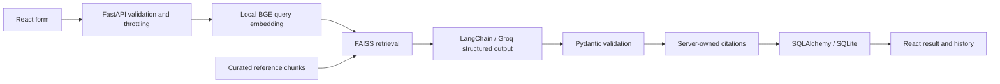

# DataTech Labs AI Project Advisor

**Turn business challenges into practical AI solution plans.**

Independent demonstration project. Not affiliated with or endorsed by DataTech Labs.

## Live application

- Frontend: [datatech-labs-ai-advisor.vercel.app](https://datatech-labs-ai-advisor.vercel.app)
- Backend: [Render API](https://datatech-labs-ai-project-advisor-api.onrender.com)
- Health: [GET /health](https://datatech-labs-ai-project-advisor-api.onrender.com/health)
- Swagger: [API documentation](https://datatech-labs-ai-project-advisor-api.onrender.com/docs)
- Repository: [cout1909/datatech-labs-ai-advisor](https://github.com/cout1909/datatech-labs-ai-advisor)

Verified on 8 October 2026: three real examples from the public frontend, cross-origin API calls, semantic retrieval, SQL history, mobile layout, and browser console checks. Hosting plans were confirmed as Vercel Hobby and Render free. Free-hosted history is ephemeral and the backend can sleep when idle.

A full-stack internship portfolio application: describe a business challenge, retrieve relevant engineering references, generate a structured AI proposal, and revisit it in SQL-backed history. The exact interviewing organization has not been confirmed, so the current corpus contains **general engineering references**, not company-service claims. See [KNOWLEDGE_BASE.md](KNOWLEDGE_BASE.md).

## Features and stack

- React, Vite, JavaScript, Tailwind CSS 4, and Lucide: responsive workspace, examples, results, copy control, and history.
- Python 3.12, FastAPI, Pydantic, and Uvicorn: validated REST endpoints, OpenAPI, safe errors, timeouts, and request limits.
- LangChain, Groq, FastEmbed ONNX, and FAISS: real semantic retrieval and structured generation.
- SQLAlchemy and SQLite: completed analyses with UUID, problem, result JSON, UTC creation time, and status.
- pytest/TestClient and Playwright: backend, database, retrieval, and browser checks.
- Docker, Render Blueprint, Vercel configuration, and GitHub Actions CI.

Results include problem understanding, recommended approach, rationale, architecture, technology stack, roadmap, expected benefits, risks, human oversight, and source metadata. The advisor uses RAG internally but can recommend classification, forecasting, OCR, deterministic automation, or other approaches. There is no silent hardcoded generation fallback.

## Architecture



Eight curated records are normalized and split at build time (600 characters, 80 overlap). The current short records produce eight chunks. Quantized BGE-small ONNX embeddings have 384 dimensions. Normalized vectors are stored in FAISS IndexFlatIP; inner product equals cosine similarity. Up to three matches above 0.58 are retrieved. This is a demo heuristic, not a confidence probability.

The cached model/index load at startup. Dataset SHA-256 and model metadata detect stale indexes. No indexing or download occurs per request. An explicitly labeled deterministic keyword fallback is used if vector initialization/query fails. Empty retrieval produces an insufficient-context notice.

Groq receives the problem and retrieved context as untrusted data. For the configured GPT-OSS model, Groq strict JSON-schema mode constrains output structure; Pydantic independently validates fields and limits. Other configurable models use JSON-object mode plus local validation. Malformed output gets one retry. Provider failures are not retried automatically. Source fields are constructed from actual retrieved records, never model-authored URLs. Schema validity does not establish factual correctness.

## Local setup (PowerShell)

Use the existing project `.venv`; do not create another environment. Keep the existing folder name safely for now.

```powershell
.\.venv\Scripts\python.exe -m pip install -r backend/requirements.lock.txt
```

If `backend/.env` does not exist, copy `backend/.env.example` to it. Configure the key in the ignored `.env`, never in `.env.example`. Do not overwrite existing credentials. Root `.env` is also supported; backend `.env` takes precedence, and process environment variables override both.

```powershell
cd backend
..\.venv\Scripts\python.exe -m app.services.rag_service
..\.venv\Scripts\python.exe -m uvicorn app.main:app --host 127.0.0.1 --port 8011
```

Second terminal:

```powershell
cd frontend
npm ci
$env:API_PROXY_TARGET='http://127.0.0.1:8011'
npm run dev
```

Open **http://localhost:5173**. Swagger: **http://127.0.0.1:8011/docs**. Health: **http://127.0.0.1:8011/health**. Vite proxies local `/api` and `/health` calls. Port 8011 avoids another application already using port 8000 on this machine. The default proxy target remains port 8000 unless API_PROXY_TARGET is set. Use Python 3.12 and Node 20.17+ or 22. The first embedding build needs internet access.

## Environment variables

| Variable | Location | Purpose |
| --- | --- | --- |
| GROQ_API_KEY | Backend secret | Required for live generation |
| GROQ_MODEL | Backend | openai/gpt-oss-20b through Groq; replaced an unavailable older model after querying the account model list |
| DATABASE_URL | Backend | SQLite URL; defaults to absolute backend/storage/advisor.db |
| CORS_ORIGINS | Backend | Comma-separated exact frontend origins |
| FRONTEND_URL | Backend | Compatible origin setting, default http://localhost:5173; used when CORS_ORIGINS is blank |
| RATE_LIMIT_PER_MINUTE | Backend | Shared per-process budget, default 10 |
| MAX_CONCURRENT_REQUESTS | Backend | Default 2 |
| VITE_API_BASE_URL | Frontend build | Public backend HTTPS origin; blank uses local Vite proxy |
| API_PROXY_TARGET | Vite development server | Optional backend target, e.g. http://127.0.0.1:8011 |

Restart the backend after configuration changes. Frontend variables are public and require a rebuild; never put keys there. SQLite is the supported SQL dialect; hosted SQL requires a driver/configuration migration.

## API and history

| Method | Path | Behavior |
| --- | --- | --- |
| GET | /health | Liveness, SQL check, key-configured flag, retrieval mode |
| GET | /api/examples | Four sample problems |
| POST | /api/analyze | Generate, validate, save, and return a proposal |
| GET | /api/history?limit=20&offset=0 | Paginated history for a browser token |
| GET | /api/history/{id} | One saved analysis in the same scope |
| GET | /api/knowledge/status | Document/chunk counts, retrieval mode, knowledge scope |
| GET | /docs | Interactive OpenAPI documentation |

```json
{"problem":"We need to automate repeated customer support questions with accurate answers and human escalation.","industry":"Retail"}
```

Problem: 20-4,000 trimmed characters. Industry is optional. `business_problem` is also accepted for compatibility. The actual streamed request body is limited to 20 KB.

Output fields: solution_name, problem_summary, recommended_approach, reasoning, human_oversight, architecture_steps, suggested_technologies, implementation_roadmap, expected_benefits, considerations, source_references, retrieval_mode, grounding_note, generation_mode, analysis_id, created_at.

The frontend sends a random UUID v4 in `X-Session-ID`. Only the token is in browser local storage; analysis data is in SQL. Direct API clients may supply a token or receive one in the analyze response's `X-Session-ID` header. History requests require that token. SQL stores its SHA-256 hash and filters all reads by it. Token possession grants access; this is an anonymous capability, not user authentication. Clearing browser storage loses history access.

SQL transactions atomically save completed validated results. Provider failures create no history entry; storage failures return an error rather than claiming success. Errors: 400 missing history token, 422 invalid input, 404 missing or other-session result, 413 oversized request, 429 shared budget exhausted, 503 provider/storage failure, 504 analysis deadline. Internal traces are never returned.

## Tests

```powershell
cd backend
..\.venv\Scripts\python.exe -m pytest -q
# Live checks use Groq quota and save three public example analyses:
..\.venv\Scripts\python.exe scripts/live_smoke.py
cd ../frontend
npm run build
npx playwright install chromium
npm test
```

Use installed Chrome instead of downloading Chromium:

```powershell
$env:PLAYWRIGHT_CHANNEL='chrome'
npm test
```

With the backend running, enable real browser-to-backend checks:

```powershell
$env:API_PROXY_TARGET='http://127.0.0.1:8011'
$env:RUN_LIVE_E2E='1'
npm test
```

Provider unit tests are mocked. The separate vector test uses the real model/index and skips if no index is built. Browser tests mock APIs unless live mode is enabled. CI builds the index and runs backend, build, and mocked browser checks without secrets. Actual outcomes are recorded in [VALIDATION.md](VALIDATION.md).

## Deployment

**The links above were deployed with owner authorization and verified.** The following describes setup/redeployment; do not create duplicate resources for the existing live app. Current Render auto-deploy is off, and the Vercel deployment was uploaded from the reviewed source snapshot. Future source changes require explicit redeployment (or connecting Git-based deployment in the dashboards).

1. Review files and create/select a GitHub repository, preferably `datatech-labs-ai-project-advisor`. Push only after authorization. Secrets, databases, model caches, dependencies, and generated artifacts are ignored.
2. In Render, create a Blueprint from `render.yaml`: free Docker backend, one worker, build-time model download/indexing, `/health`. Set GROQ_API_KEY securely and CORS_ORIGINS to the eventual Vercel origin. DATABASE_URL uses `/app/storage/advisor.db`.
3. In Vercel, import the repository with `frontend` as root, Vite preset, build `npm run build`, output `dist`. Set VITE_API_BASE_URL to the Render HTTPS origin.
4. Set Render's exact allowed origin to the real Vercel URL. Explicitly add preview origins if needed. Redeploy after frontend variable changes.
5. Check `/health`, `/docs`, and `/api/knowledge/status`, then submit real examples and verify result rendering, SQL history, sources, and CORS. Record URLs only after verification.

Render's free service has [512 MB RAM](https://render.com/docs/compute-plans) and [idle spin-down](https://render.com/docs/free). A small quantized model, one embedding thread, tiny index, and one worker reduce resource use; target-container memory must still be tested. The model and index are baked into the Docker image. **Free-hosted SQLite is ephemeral:** restarts/redeployments can erase history. Durable history needs a persistent disk or managed SQL migration. No paid infrastructure has been provisioned.

References: [Render Blueprint](https://render.com/docs/blueprint-spec), [Vite on Vercel](https://vercel.com/docs/frameworks/frontend/vite), [Groq JSON output](https://console.groq.com/docs/structured-outputs).

## Limitations

- The exact interviewing company remains unverified. General references must not be represented as company offerings.
- Inputs go to Groq and are saved in SQL. Avoid personal/confidential information. Anonymous tokens are not production authentication.
- Eight English summaries are a small demonstration corpus; relevance thresholds and factual accuracy need broader evaluation.
- Prompt instructions, retrieval, and schema validation reduce errors but do not eliminate hallucination or prompt injection.
- Rate limits are shared per process and reset on restart. Production needs distributed abuse controls, spend limits, authentication, observability, retention policies, and durable storage.
- No uploads, user accounts, fine-tuning, or agent runtime is included. The app proposes projects; it does not implement every proposed solution.
- Provider quotas, model availability, hosting cold starts, and external font loading can affect behavior.

See [INTERVIEW_GUIDE.md](INTERVIEW_GUIDE.md) for the demo script and technical explanation.
